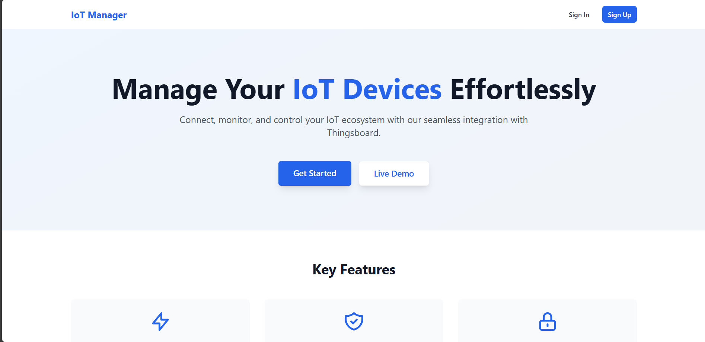
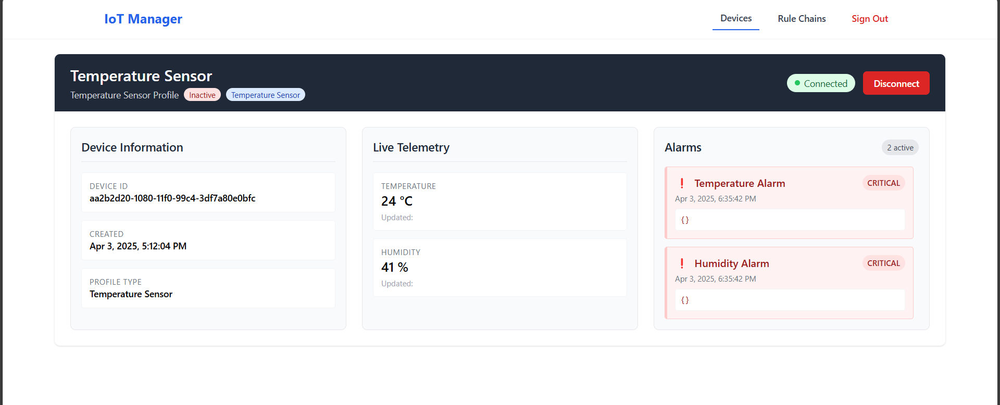

## IOT Device Managemnet using Thingsboard API

 
📌 Overview
This project demonstrates ThingsBoard, an open-source IoT platform, with:
✅ Local Docker Setup
✅ Simulated IoT Devices (Temperature Sensor & Power Meter)
✅ Rule Engine Configuration (Alarms & Logging)
✅ Custom Frontend Dashboard (Angular + Spring Boot)

🚀 Features
Feature	Description
Local Setup	Dockerized ThingsBoard with PostgreSQL
Device Simulation	Two simulated devices with random data generation
Rule Engine	Threshold-based alarms for temperature & power
Custom Frontend	Enhanced dashboard with alarms & device health

⚙️ Setup & Installation
1. Prerequisites
Docker & Docker Compose

Java 17

Node.js & Angular CLI

Postman (for API testing)

2. Run ThingsBoard with Docker
bash
Copy
# Clone the repository
git clone 
cd thingsboard-demo

# Start ThingsBoard with PostgreSQL
docker-compose up -d
Access:
🔗 ThingsBoard UI: http://localhost:8080 (Default credentials: tenant@thingsboard.org / tenant)

3. Backend (Spring Boot) Setup
bash
Copy
cd backend
mvn clean install
java -jar target/thingsboard-service-0.0.1.jar
API Endpoints:

GET /api/iot/devices/{pageSize}/{page} → List all registered devices

GET /api/iot/{deviceId}/alarms → Fetch active alarms

4. Frontend (Angular) Setup
bash
Copy
cd frontend
npm install
ng serve
Access:
🔗 Custom Dashboard: http://localhost:4200

📊 Custom Frontend Dashboard
Dashboard Preview

Features:
✔ Device List
✔ Alarm Notifications (Color-coded by severity)
✔ Health Status Indicators
  
📜 Documentation & Resources
ThingsBoard Docs: https://thingsboard.io/docs

⚠️ Troubleshooting
Issue	Solution
Docker ports conflict	Change 8080:9090 in docker-compose.yml
Frontend CORS errors	Configure proxy.conf.json in Angular

🎓 Learning Outcomes
✅ IoT Platform Architecture

✅ Rule Engine & Alarm Management

✅ Angular + Spring Boot Integration

Would you like any modifications or additional details? 😊
